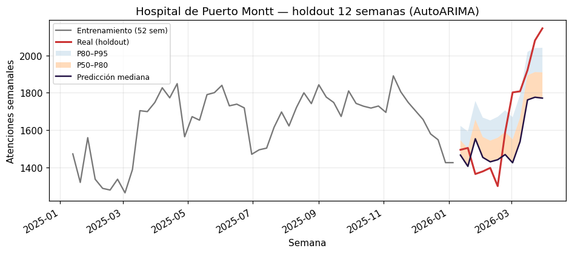
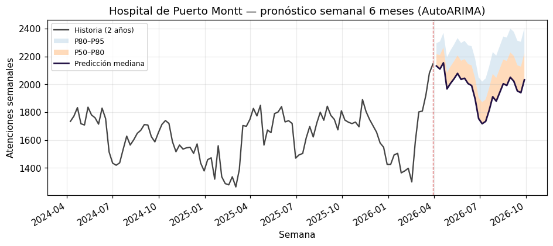

# urgencias-core

Código de referencia para análisis, simulación y forecasting de servicios de
urgencia en Chile. Fundación abierta de **Eunosia**.

*Read this in [English](README.md).*

Convierte datos visit-level de urgencia en series horarias de ocupación, agrega
características de calendario chileno, pronostica llegadas/ocupación con bandas
cuantiles y corre un simulador Monte Carlo de censo — además de un lector del
dataset público DEIS MINSAL y un dashboard web mínimo.

## Instalación

```bash
pip install urgencias-core            # librería core (datos, series, features, simulación)
pip install "urgencias-core[all]"     # todo: modelos, visualización, servidor y fetchers
```

La instalación core es deliberadamente liviana
(pandas/numpy/pyarrow/holidays/pydantic). Las capacidades más pesadas viven
detrás de extras — un módulo que necesita uno lanza un error claro indicando
qué instalar:

| Extra | Incluye | Habilita |
|---|---|---|
| `models` | lightgbm, statsforecast, scikit-learn | forecasters LightGBM/statsforecast |
| `viz` | matplotlib, tabulate | gráficos y tablas markdown (demos, servidor) |
| `server` | fastapi, uvicorn, jinja2 (+ `viz`) | el servidor dashboard de referencia |
| `fetch` | httpx | clientes de red DEIS MINSAL y Open-Meteo |
| `all` | todo lo anterior | los demos y la suite completa de tests |

## Quickstart

Tras `pip install "urgencias-core[all]"` quedan disponibles tres comandos de
consola. Corren sobre datos incluidos en el paquete y escriben en `./outputs`:

```bash
urgencias-demo-synthetic          # pipeline completo incl. simulación → 3 PNG
urgencias-demo-deis --offline     # forecasting sobre datos reales de DEIS
urgencias-server                  # dashboard de referencia en http://127.0.0.1:8000
```

Desde un clon del repositorio con [uv](https://docs.astral.sh/uv/):

```bash
git clone https://github.com/nicoveraz/urg-forecast-core
cd urg-forecast-core
uv sync --all-extras

uv run urgencias-demo-synthetic
uv run urgencias-demo-deis --offline
uv run urgencias-server
```

El demo sintético se ejecuta en segundos contra una fixture sintética compacta
de un año (~13 000 atenciones) incluida en el paquete. El demo DEIS descarga
datos reales (o cae al snapshot offline incluido) y escribe tablas de
backtesting + pronósticos a 6 meses.

## Qué produce el pipeline

Las figuras a continuación son el resultado directo de correr los dos demos
contra los datos incluidos.

### 1. De atenciones a serie horaria de ocupación

El loader `urgencias_core.data.timeseries` convierte el parquet visit-level
(una fila por atención, con timestamps de ingreso y egreso) a una serie horaria
de censo usando el truco de cumsum de eventos (+1 al ingreso, –1 al egreso,
cumsum reindexado a la grilla horaria). La figura muestra la última semana de la
fixture sintética: un ciclo diurno claro con valles nocturnos y picos
vespertinos, consistentes con el patrón esperado de una urgencia chilena de
tamaño medio.


### 2. Capa de forecasting — pronóstico horario 48 h

Sobre esa misma serie, el baseline `SeasonalNaiveBaseline` produce un pronóstico
horario a 48 horas con intervalos cuantiles P50–P80 y P80–P95. Los modelos más
fuertes (`AutoARIMA`, `AutoETS`, `LGBQuantile`) se comparan en el harness de
evaluación y viven bajo la misma interfaz `Forecaster`.


### 3. Motor de simulación Monte Carlo

El motor `urgencias_core.simulation.engine` toma llegadas futuras (muestreadas
desde el pronóstico) y para cada llegada samplea un LOS empírico condicional en
(agudeza, hora de llegada). Iterando M réplicas produce bandas de incertidumbre
del censo 24 horas hacia adelante — la base para decisiones de surge y tablas de
turnos.


### 4. Datos reales — backtest semanal sobre DEIS

El demo DEIS corre la misma capa de forecasting contra atenciones de urgencia
reales del Hospital de Puerto Montt. El holdout separa las últimas 12 semanas
como test y entrena sobre las 52 previas. La figura muestra que `AutoARIMA`
captura la mediana con el verdadero dentro de la banda P80–P95 en la mayoría de
las semanas — evidencia de que el pipeline sintético no está sobreajustado al
régimen de la fixture.



### 5. Pronóstico operacional a 6 meses

Con el modelo validado, el demo reentrena sobre toda la historia y emite un
pronóstico semanal a 26 semanas — el horizonte útil para planificación de
turnos, presupuesto e insumos. La banda P80–P95 se ensancha con el horizonte,
como es de esperar.



### 6. Dashboard de referencia

El servidor FastAPI (`urgencias-server`) expone 4 rutas con los mismos gráficos
del pipeline pero vivos en el navegador. Es deliberadamente minimal — Jinja2 +
matplotlib embebido como base64, sin JavaScript. Pensado como punto de partida
para que un hospital lo clone y adapte.

<p align="center">


</p>
<p align="center">


</p>

## Qué hay adentro

| Módulo | Para qué sirve |
|---|---|
| `urgencias_core.data.loader` | Lee un parquet visit-level y valida el esquema. |
| `urgencias_core.data.timeseries` | Convierte atenciones a serie horaria (llegadas, altas, ocupación por agudeza, LOS medio) con el truco de cumsum de eventos. |
| `urgencias_core.data.deis` | Cliente del DEIS MINSAL (fetch + caché + filtro a hospitales demo) con fallback offline al snapshot. |
| `urgencias_core.features.calendar` | Festivos `holidays.CL`, días puente, calendario escolar, eventos regionales configurables (Semana Musical de Frutillar por defecto). |
| `urgencias_core.features.weather` | Cliente de Open-Meteo con caché en disco, Puerto Montt por defecto. |
| `urgencias_core.models.protocol` | Protocolo `Forecaster` y `HorizonSpec` (agnóstico del grano: horario, diario, semanal, mensual). |
| `urgencias_core.models.lgb_quantile` | LightGBM quantile regression, un modelo por cuantil, features de calendario. |
| `urgencias_core.eval.baselines` | `SeasonalNaiveBaseline` + envoltorios de `statsforecast` (AutoARIMA, AutoETS, AutoTheta, MSTL). |
| `urgencias_core.eval.harness` | Evaluación side-by-side con regla de advertencia ≥5% (un modelo que no supera a los baselines no debería producir). |
| `urgencias_core.simulation.los_empirical` | Muestreador empírico de LOS condicional en (agudeza, hora de llegada). |
| `urgencias_core.simulation.engine` | Simulación Monte Carlo de censo forward 24 horas. |
| `urgencias_core.server` | Servidor FastAPI mínimo (4 rutas, Jinja2, matplotlib base64, sin JS). |

## Datos públicos: DEIS MINSAL

El demo DEIS usa datos abiertos del Departamento de Estadísticas e Información de
Salud del Ministerio de Salud ([deis.minsal.cl](https://deis.minsal.cl/#datosabiertos))
para dos hospitales del Servicio de Salud Reloncaví:

- **Hospital de Puerto Montt** (código DEIS 24-105, alta complejidad). Conocido
  localmente como Hospital Base de Puerto Montt.
- **Hospital de Frutillar** (código DEIS 24-115, baja complejidad).

DEIS publica esta serie desde 2008 hasta el presente. El archivo del año en
curso se actualiza semanalmente durante la campaña de invierno respiratoria
(marzo–septiembre) y aproximadamente mensualmente fuera de ella. El demo usa
automáticamente el último año disponible al momento de ejecutarse y produce un
pronóstico a 6 meses.

**Por qué estos dos hospitales.** Son centros de referencia regional en Los
Lagos con datos de acceso público. La elección es pragmática y geográfica, no
evaluativa.

**Enmarcamiento estrictamente metodológico.** Esta demostración usa datos
públicos de DEIS MINSAL para mostrar el funcionamiento de las herramientas de
forecasting sobre datos reales de hospitales chilenos. No constituye una
evaluación operacional, clínica ni de calidad de los hospitales mencionados.

**Atribución y licencia.** Los datos son publicados por DEIS MINSAL bajo el
marco chileno de datos abiertos. Si usa este código o sus derivados para
investigación, mantenga la atribución a DEIS y, cuando sea relevante, a
`urgencias-core`. El snapshot offline incluido en el paquete es un extracto
filtrado del dataset público para reproducibilidad; no exime al usuario de
fetchar directamente desde la fuente en usos operacionales.

## Estado del proyecto

`urgencias-core` es una fundación abierta, desarrollada y mantenida por Nicolás
Vera Z. como base de **Eunosia**, una plataforma de IA clínica para medicina de
urgencia. Se publica en PyPI y se mantiene con esfuerzo razonable: mientras esté
en 0.x la API puede cambiar entre versiones menores, y los issues y pull
requests son bienvenidos pero sin garantía de respuesta rápida. Si necesitas
soporte comercial o trabajo a medida sobre esta base, contacta al autor.

Ver [`CONTRIBUTING.md`](CONTRIBUTING.md) para desarrollo y proceso de release,
[`docs/decisions.md`](docs/decisions.md) para decisiones arquitectónicas, y
[`docs/roadmap.md`](docs/roadmap.md) para items diferidos (soporte mdb/xlsx
pre-2020 de DEIS, neuralforecast, integración EMR para separar workup de
boarding).

## Cómo citar

Si usas `urgencias-core` en investigación, por favor cítalo. Los metadatos
legibles por máquina están en [`CITATION.cff`](CITATION.cff) (GitHub muestra un
botón "Cite this repository"). Cada release etiquetado se archiva en
[Zenodo](https://zenodo.org/) con un DOI. Hay un paper de software (formato
JOSS) y un preprint de métodos más completo en [`paper/`](paper). Por favor
menciona además a Eunosia y enlaza al repositorio.

## Licencia

MIT. Ver [LICENSE](LICENSE).
